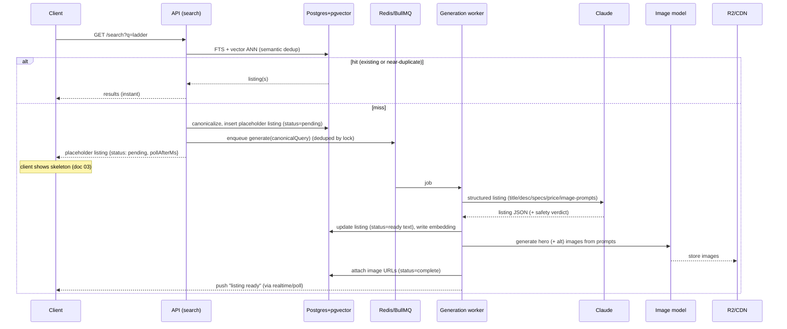
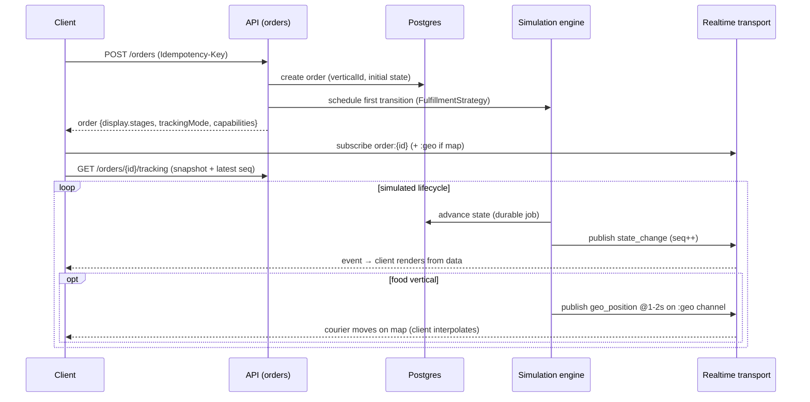

# 00 — Dopamine App: Architecture Overview

> **Read this first.** It stitches the five deep-dive docs into one picture: the
> product, the system architecture, the cross-cutting contracts that hold the
> pieces together, and the one principle everything is organized around —
> **the Vertical**. Each section links to the doc that goes deeper.

| # | Doc | Owns |
|---|---|---|
| 00 | **this** | The big picture, system diagrams, cross-cutting contracts |
| 01 | [Backend & domain architecture](./01-backend-domain-architecture.md) | Domain model, Vertical abstraction, API, services, DB schema |
| 02 | [AI generation pipeline](./02-ai-generation-pipeline.md) | On-demand listing generation (Claude text + image model) |
| 03 | [Client architecture](./03-client-architecture.md) | Web + iOS (+ Android), server-driven UI, generation/tracking UX |
| 04 | [Real-time tracking](./04-realtime-tracking.md) | Pluggable tracking, simulation engine, transport, geo streaming |
| 05 | [Infrastructure & cost](./05-infrastructure-and-cost.md) | Hosting, DB host choice, cost model |
| 06 | [Adding a vertical (food)](./06-extensibility-adding-a-vertical.md) | The end-to-end extensibility walkthrough |
| 07 | [Roadmap & build order](./07-roadmap.md) | Phased plan, milestones, who-can-start-where |

---

## 1. What we're building

A **Dopamine app** — a gamified, delightful *fake*-shopping simulator. Users
browse fake listings, place fake orders, and track them through fake
fulfillment. No real money, no real goods. The point is the *feeling*: satisfying
search, instant gratification, celebratory tracking.

Two things make it interesting to build:

1. **The catalog generates itself.** Search for something nobody has searched
   before — "a ladder" — and the backend calls a language model to invent a
   realistic listing (title, description, specs, price) plus AI-generated photos,
   persists it, and serves it. The next person who searches "ladder" gets a
   real, instant result. The catalog grows from demand. _(doc 02)_

2. **It must be extensible to new "verticals."** Today: generic **retail** with
   slow shipping-style tracking. Tomorrow: **food ordering** with a faster order
   lifecycle and a live courier-on-a-map. Adding that should be **additive** —
   new config + a few strategy classes — **not a rewrite**. _(doc 06)_

Clients: **web + iOS** now, **Android** likely later. _(doc 03)_

---

## 2. The one big idea: the Vertical

Everything that differs between "retail" and "food" is captured behind a single
abstraction — the **Vertical** — and resolved at runtime by a `verticalId`. The
core platform (catalog, search, cart, orders, generation, real-time transport)
is **vertical-agnostic**. Each vertical plugs in three kinds of strategy:

```
                         ┌──────────────────────────┐
                         │     Vertical Registry     │
                         │  verticalId → config +    │
                         │  strategy implementations │
                         └────────────┬─────────────┘
            ┌─────────────────────────┼──────────────────────────┐
            ▼                         ▼                          ▼
   ┌──────────────────┐   ┌────────────────────┐    ┌─────────────────────┐
   │ GenerationStrategy│   │ FulfillmentStrategy│    │  TrackingProvider   │
   │ (prompt+schema    │   │ (order lifecycle   │    │ (state machine +    │
   │  per vertical)    │   │  state machine)    │    │  cadence + geo?)    │
   └──────────────────┘   └────────────────────┘    └─────────────────────┘
        doc 02                   doc 01                    doc 04
```

| Vertical | Catalog shape | Generation | Order lifecycle | Tracking |
|---|---|---|---|---|
| **retail** (now) | product (JSONB attrs) | product prompt+schema | confirmed→packed→shipped→out-for-delivery→delivered (slow) | timeline, no geo |
| **food** (later) | menu item / restaurant | menu prompt+schema | accepted→preparing→picked-up→en-route→delivered (fast) | live map + courier geo |

The data model uses **Postgres JSONB** for per-vertical attributes so no schema
migration is needed to add a vertical. The **API and clients never hardcode
these lifecycles** — the server sends the stages and a `trackingMode` as *data*,
and the client renders from it (see §4, the cross-cutting contracts).

---

## 3. System architecture

### 3.1 End-to-end component map

```
┌──────────────┐   ┌──────────────┐   ┌──────────────┐
│  Web (Next)  │   │ iOS (Expo RN)│   │Android(later)│
└──────┬───────┘   └──────┬───────┘   └──────┬───────┘
       │   REST / OpenAPI (typed SDKs)        │
       └───────────────┬──────────────────────┘
                       │            ▲  SSE/pub-sub (tracking stream)
                       ▼            │
        ┌───────────────────────────────────────────────────────┐
        │             API service (NestJS modular monolith)      │
        │                                                        │
        │  identity │ catalog │ search │ cart │ orders │ realtime│
        │           │         │   │     │      │   │     gateway  │
        └───────────┼─────────┼───┼─────┼──────┼───┼─────────────┘
                    │         │   │           │   │
          ┌─────────┘         │   │ search    │   │ subscribe
          │ reads/writes      │   │ miss      │   │ to order topics
          ▼                   │   ▼           ▼   ▼
   ┌─────────────┐            │  ┌────────────────────────────┐
   │  Postgres   │◄───────────┘  │  Generation pipeline (02)  │
   │  +pgvector  │  persist      │  ┌──────────────────────┐  │
   │  +FTS +JSONB│◄──listing─────┤  │ canonicalize+dedup   │  │
   └─────┬───────┘               │  │ Claude → listing JSON│  │
         │ outbox events         │  │ image model → photos │  │
         ▼                       │  └──────────┬───────────┘  │
   ┌─────────────┐               └─────────────┼──────────────┘
   │ Redis       │  queue/cache                │ images
   │ (BullMQ)    │◄────────────────────────────┘
   └─────┬───────┘                             ▼
         │ delayed jobs                 ┌──────────────┐
         ▼                              │ R2 + CDN     │
   ┌─────────────────────┐             │ (images)     │
   │ Simulation engine(04)│            └──────────────┘
   │ advances fake orders │
   │ → emits state + geo  │──────► Realtime transport (Ably / self-host)
   └─────────────────────┘            ──► clients (SSE/pub-sub)

   External: Anthropic Claude (text)  +  text-to-image provider  (doc 02)
```

### 3.2 Flow A — search that triggers generation _(the signature feature)_



Key properties (all detailed in `01` §4 and `02`): **non-blocking** (user gets a
skeleton instantly), **deduped** (semantic + a Redis lock so two people searching
"ladder" at once generate once), **idempotent** (unique `(storefront,
canonical_query)` constraint), and the AI side only implements a
`GenerationProvider` interface — the backend owns queueing, persistence, image
ingestion, and rate limiting.

### 3.3 Flow B — place order & track _(vertical-agnostic)_



---

## 4. Cross-cutting contracts (the seams that keep teams independent)

These are the agreements that let the five tracks be built in parallel. They are
the **load-bearing interfaces** — change them deliberately.

### 4.1 Vertical-agnostic rendering (backend ↔ clients) — _doc 01 §, doc 03_
Order and listing payloads carry presentation as **data**, not code:
- `display.stages[]` — server-defined lifecycle stages to render
- `trackingMode` — `timeline` (retail) | `map` (food) → selects the client renderer
- `capabilities.liveLocation` — whether to open the geo channel

> **Rule:** clients render lifecycle from server data and treat state enums as
> **per-vertical, not a global enum**. Same client code renders retail and food.

### 4.2 Generation contract (backend ↔ AI pipeline) — _doc 01 §4.2, doc 02_
- Backend → AI: `GenerationRequest { canonicalQuery, verticalId, context }`
- AI → backend: `GenerationResult { listing fields, imagePrompts[], embedding?, safetyVerdict }`
- The AI track implements a `GenerationProvider`; the **backend** owns dedup,
  queueing, idempotency, image ingestion to R2, indexing, and rate limiting.
- **Client-facing generation states:** `pending → partial → ready → failed`
  (text can be `ready` before images arrive → progressive image load in UI).

### 4.3 Real-time event contract (realtime ↔ clients) — _doc 04 §5_
Two channel families per order:
- `order:{orderId}` — low-frequency `state_change` events
- `order:{orderId}:geo` — high-frequency `geo_position` events (map verticals only)

Every event carries a **per-channel, per-order, gap-free monotonic `seq`** and a
server `ts`. Client rules: apply in `seq` order, drop `seq <= lastApplied`
(idempotent), trust server `ts`/`etaMs` over local clock, geo frames are
droppable (interpolate to newest), state events are not. Catch-up on reconnect =
**snapshot (`GET /orders/{id}/tracking`) + replay from `seq`** so there are no
gaps.

### 4.4 Transport choices that ripple
- **REST + OpenAPI 3.1** is the durable contract (generates Swift/Kotlin/TS SDKs;
  tRPC was rejected because it's TS-only and can't serve native mobile). _doc 01_
- **SSE over WebSockets** for tracking (built-in `Last-Event-ID` replay), with a
  **polling fallback** when SSE can't hold. Managed **Ably** hosts the stateful
  layer at MVP. _doc 04_

---

## 5. Recommended stack at a glance

| Layer | Choice | Doc |
|---|---|---|
| Backend | **NestJS + TypeScript**, modular monolith (split later) | 01 |
| API | REST + **OpenAPI 3.1**, URL-versioned `/v1` | 01 |
| Primary store | **Postgres** + `pgvector` + FTS + JSONB | 01, 05 |
| Object storage/CDN | **Cloudflare R2 + CDN** (zero egress) | 05 |
| Cache/queue | **Redis** (Upstash) + **BullMQ** | 04, 05 |
| LLM (text) | **Claude** (model choice per doc 02 / claude-api skill) | 02 |
| Images | Dedicated **text-to-image** provider (doc 02) | 02 |
| Real-time | **Ably** (managed) → self-host Redis pub/sub later | 04 |
| Simulation | **BullMQ delayed jobs** (Temporal as escape hatch) | 04 |
| Clients | **Expo / React Native** (iOS+Android) + **React/Next.js** (web), one TS monorepo | 03 |
| Native polish | surgical **SwiftUI** escape hatches (Fabric/Nitro) on hero screens | 03 |
| Maps | **MapLibre** (+ MapTiler tiles), Mapbox as paid upgrade | 03 |
| Hosting | PaaS (Fly/Render) + Vercel → AWS at scale | 05 |
| DB host | Managed (**Neon**/Supabase) until you have ops | 05 |
| CI / IaC / obs | GitHub Actions / OpenTofu / Grafana Cloud / Sentry | 05 |

---

## 6. Principles (apply these when extending the system)

1. **Verticals are config + strategies, never `if (vertical === 'food')` scattered
   in core code.** If you're tempted to branch on vertical outside a registered
   strategy, the abstraction is leaking — fix the seam instead.
2. **The client renders from data.** Lifecycles, stages, tracking mode, and
   capabilities come from the server. No hardcoded enums of states in clients.
3. **Generation is async and deduped.** Never block a request on the LLM. Always
   canonicalize + check semantic duplicates first.
4. **Cost lives in AI + image egress, not infra.** Optimize cache-hit rate and
   egress before micro-optimizing compute or the DB. _(doc 05)_
5. **Contracts are versioned and additive.** Adding a vertical never bumps the API
   version; schema/event changes are additive-only.
6. **Source of truth is the database.** Transport (SSE/pub-sub) is a delivery
   accelerator; clients can always reconstruct state from a snapshot + replay.

---

## 7. How to add a new vertical (the 30-second version)

To add **food ordering**, a developer:
1. Registers a `food` **Vertical config** (catalog schema variant, display labels).
2. Implements a `GenerationStrategy` (menu-item prompt + schema). _doc 02_
3. Implements a `FulfillmentStrategy` (fast state machine + timings). _doc 01_
4. Implements a `TrackingProvider` that `emitsGeo()` + supplies a `geoPlan()`
   (OSRM route). _doc 04_
5. Registers a client **tracking renderer** for `trackingMode: map` (live map).
   _doc 03_

No changes to the cart, the order-placement path, the API version, the DB schema,
the generation queue, or the real-time transport. The full, concrete walkthrough
with code-shaped examples is **[doc 06](./06-extensibility-adding-a-vertical.md)**.
