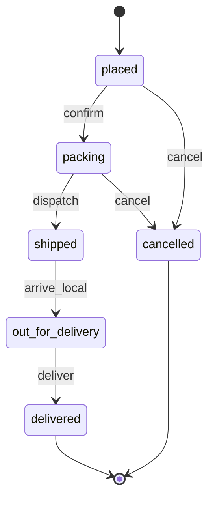
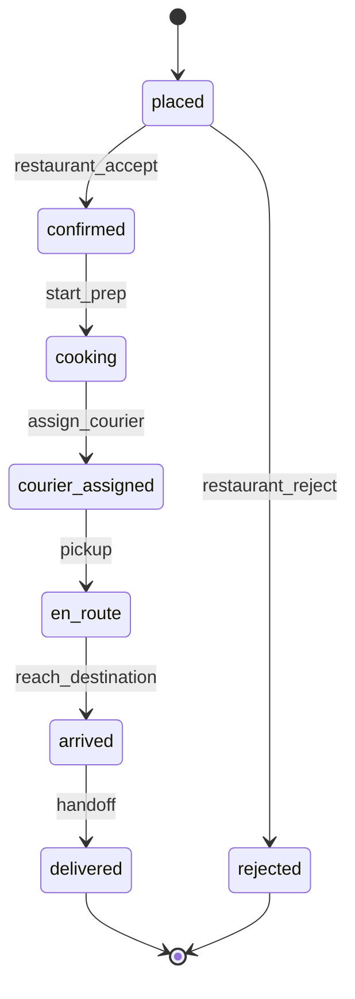

# Backend & Domain Architecture

> **Product:** "Dopamine app" — a satisfying, gamified shopping *simulator*. Users place **fake** orders, browse **fake** listings, and track **fake** orders through fake fulfillment stages. No real payments, no real fulfillment.
>
> **Status:** Design proposal (greenfield). Author: Backend/Platform architecture track.
> **Date:** 2026-06-20
> **Audience:** New backend engineers, the AI-pipeline track, the client track (web/iOS/Android), and the real-time track.

---

## 0. TL;DR / Decision summary

| Decision | Recommendation | Why |
|---|---|---|
| Topology | **Modular monolith first**, with seams cut for later extraction | Small team; CNCF 2025 data shows ~42% of orgs *consolidating* microservices. Move fast, keep optionality. |
| Language/framework | **TypeScript + NestJS** (Fastify adapter) | Enforced modularity prevents architectural drift; one language shared with web/RN clients; first-class DI for the plugin/registry model this product needs. |
| API style | **REST (OpenAPI) as the contract**, **SSE** for live order tracking | Heterogeneous clients (web + iOS + Android, maybe more). REST/OpenAPI is the honest, polyglot-friendly choice; tRPC is excluded (TS-to-TS only). |
| Primary store | **PostgreSQL** | Relational integrity for orders/carts + JSONB for per-vertical flex + `pgvector` for semantic dedup, all in one engine. |
| Search/index | **Postgres FTS + `pgvector`** day one; Typesense/OpenSearch later if needed | Avoids a second datastore early; single SQL query joins relational filters + vector similarity. |
| Object storage | **S3-compatible** (S3 / Cloudflare R2) + CDN | Generated images are blobs; keep them out of the DB. |
| Cache / ephemeral | **Redis** | Cache, rate limiting, SSE fan-out (pub/sub), and job queue backend. |
| Async / jobs | **BullMQ** (Redis) for generation + fulfillment ticks; **Temporal** is the documented upgrade path | Simple fire-and-forget + scheduled ticks fit a queue. Temporal reserved for if/when lifecycles get genuinely multi-step and saga-like. |
| Order lifecycle | **Per-vertical state machine** (declarative config; XState-style) | Retail (slow shipping) and food (fast + courier map) are *different machines* behind one interface. |
| Extensibility | **Vertical Registry + Strategy plugins** (fulfillment, tracking) selected by `verticalId` | "Add food" = register config + two strategy classes + a tracking provider. Additive, not a rewrite. |

The single most important architectural idea in this document: **the `Vertical` is the unit of extensibility.** Everything that differs between "retail" and "food" (catalog shape, order state machine, fulfillment timing, tracking style) is resolved through a `Vertical` plugin, selected at runtime by a `verticalId` carried on the catalog and the order. Clients stay vertical-agnostic.

---

## 1. Domain model

### 1.1 Core entities

```
┌────────────┐        ┌──────────────┐        ┌───────────────┐
│   User     │        │   Vertical   │◄───────│  StoreType /  │
│ (identity) │        │ (registry)   │        │   Storefront  │
└─────┬──────┘        └──────┬───────┘        └───────┬───────┘
      │                      │ verticalId             │
      │                      ▼                         ▼
      │              ┌───────────────┐         ┌───────────────┐
      │              │   Category    │◄────────│   Listing /   │
      │              │  (Catalog)    │         │   Product     │
      │              └───────────────┘         └──────┬────────┘
      │                                               │
      ▼                                               ▼
┌────────────┐   add item   ┌──────────────┐   snapshot   ┌──────────────┐
│    Cart    │─────────────►│   CartItem   │─────────────►│   OrderItem  │
└─────┬──────┘              └──────────────┘              └──────┬───────┘
      │ checkout                                                 │
      ▼                                                          ▼
┌────────────┐  drives   ┌──────────────────┐   emits    ┌──────────────┐
│   Order    │──────────►│ FulfillmentPlan  │───────────►│ TrackingEvent │
│ (state)    │           │ (per-vertical)   │            │  / Position   │
└────────────┘           └──────────────────┘            └──────────────┘
```

### 1.2 Entity reference

| Entity | Purpose | Key fields | Notes |
|---|---|---|---|
| **User** | Identity & ownership | `id`, `handle`, `auth_provider`, `created_at` | Lightweight; this is a toy, not a CRM. Anonymous/device users allowed (see §3.2). |
| **Vertical** | The extensibility axis | `id` (`retail`, `food`), `display_name`, `config` (JSONB), `fulfillment_strategy_key`, `tracking_provider_key`, `state_machine_key` | **Mostly config + registry, not a heavy table.** Backs the plugin selection. |
| **Storefront** | A concrete store inside a vertical | `id`, `vertical_id`, `name`, `theme`, `config` | e.g. retail "Mega-Mart", food "Sushi Place". One vertical → many storefronts. |
| **Category** | Catalog taxonomy | `id`, `storefront_id`, `parent_id`, `name`, `slug` | Self-referential tree. |
| **Listing / Product** | A catalog item | `id`, `storefront_id`, `vertical_id`, `title`, `description`, `price_cents`, `currency`, `attributes` (JSONB), `image_urls[]`, `embedding` (vector), `search_doc` (tsvector), `origin` (`seeded`/`generated`), `canonical_query`, `status` | `attributes` JSONB absorbs per-vertical differences (size/color vs. spice/calories). `embedding` + `canonical_query` power generation dedup (§4). |
| **Cart** | In-progress selection | `id`, `user_id`, `storefront_id`, `status`, `updated_at` | One active cart per (user, storefront). |
| **CartItem** | Line in a cart | `id`, `cart_id`, `listing_id`, `qty`, `unit_price_cents` | References live listing. |
| **Order** | Committed purchase | `id`, `user_id`, `vertical_id`, `storefront_id`, `state`, `state_machine_key`, `total_cents`, `placed_at`, `idempotency_key`, `metadata` (JSONB) | `state` validated against the vertical's state machine. |
| **OrderItem** | Frozen line in an order | `id`, `order_id`, `listing_id`, `title_snapshot`, `unit_price_snapshot`, `qty` | **Snapshots** title/price at order time so later catalog edits don't mutate history. |
| **FulfillmentPlan** | The "script" for advancing an order | `id`, `order_id`, `vertical_id`, `steps` (JSONB), `current_step`, `next_tick_at` | Generated by the vertical's fulfillment strategy at checkout. Retail = slow multi-day; food = minutes. |
| **TrackingEvent** | Discrete status change | `id`, `order_id`, `state`, `label`, `occurred_at`, `payload` (JSONB) | Append-only timeline. Clients render generically. |
| **CourierPosition** | Live geo for map-tracking verticals | `order_id`, `lat`, `lng`, `heading`, `recorded_at` | Only emitted by verticals whose tracking provider is geo-capable (food). Retail never emits these. |

### 1.3 The `Vertical` abstraction — how retail and food coexist

A `Vertical` is a **named bundle of strategies + config**. The *data* differences live in JSONB (`Listing.attributes`, `Order.metadata`); the *behavior* differences live in pluggable strategies selected by key. Nothing in `Order`/`Listing`/`Cart` schema is retail-specific or food-specific.

```ts
// Conceptual interface (illustrative, not final code)
interface Vertical {
  id: string;                         // "retail" | "food"
  displayName: string;
  stateMachine: OrderStateMachine;    // defines states + transitions (§1.4)
  fulfillment: FulfillmentStrategy;   // builds the FulfillmentPlan + advances it (§6)
  tracking: TrackingProvider;         // shapes how clients subscribe to updates (§6)
  catalogPolicy: CatalogPolicy;       // attribute schema, whether generation is allowed
}
```

| Concern | Retail | Food |
|---|---|---|
| Order lifecycle speed | Days (simulated, accelerated) | Minutes |
| Tracking style | Linear status timeline | Status timeline **+ live courier position on a map** |
| Catalog generation | Enabled (the "ladder" feature) | Optional / disabled (menus are curated) |
| `attributes` JSONB | size, color, brand | calories, spice, prep_time, allergens |
| Fulfillment plan | `placed → packed → shipped → out_for_delivery → delivered` over days | `placed → confirmed → cooking → courier_assigned → en_route → arrived` over minutes |

### 1.4 Order lifecycle as a per-vertical state machine

The order lifecycle is **not** one hardcoded enum. Each vertical declares a state machine. The Orders service is generic: it only knows "ask the vertical's machine whether transition X→Y is legal, then apply it." We model this declaratively (statechart-style, e.g. XState v5 config — chosen because the order graph is a clean transition graph and a declarative definition is data we can store/version per vertical).

**Retail machine:**



**Food machine (different states, faster, plus courier substate):**



Key rules enforced generically by the Orders module:
- **Transitions are validated** against the active machine. Illegal transitions are rejected (HTTP 409).
- **Terminal states** (`delivered`, `cancelled`, `rejected`) close the order and stop the fulfillment ticker.
- Every transition **emits a `TrackingEvent`** (append-only), which is what the tracking stream broadcasts.
- The state machine definition is keyed by `state_machine_key` and **versioned** — an in-flight order keeps the machine version it was created with, so changing the retail machine doesn't corrupt live orders.

---

## 2. Service / module decomposition

### 2.1 Recommendation: modular monolith first

For a small team that wants to scale later, the current (2025/2026) consensus is clear: **start with a modular monolith.** Microservices add coordination, network, and DevOps overhead that a small team pays for immediately and benefits from only at a scale this product doesn't have yet. CNCF 2025 survey data shows roughly **42% of organizations actively consolidating** microservices back into larger deployment units — "microservices were overapplied." Monoliths are recommended for teams under ~20 developers, evolving requirements, and strong data-consistency needs — all true here.

**But we cut the seams now** so extraction is cheap later: each module owns its tables, exposes an in-process interface (a NestJS provider), and communicates with peers through those interfaces and a domain event bus — never by reaching into another module's tables.

### 2.2 Modules (bounded contexts)

```
                         ┌──────────────────────────────────────┐
   web / iOS / Android   │            API Gateway layer          │
        clients  ───────►│   (REST controllers + SSE endpoints)  │
                         └───────────────┬──────────────────────┘
                                         │  in-process calls + Event Bus
   ┌──────────┬───────────┬─────────────┼─────────────┬───────────────┬────────────┐
   ▼          ▼           ▼             ▼             ▼               ▼            ▼
┌────────┐ ┌────────┐ ┌────────┐  ┌──────────┐  ┌──────────────┐ ┌──────────┐ ┌──────────┐
│Identity│ │Catalog │ │ Search │  │   Cart   │  │    Orders    │ │Fulfill./ │ │Generation│
│        │ │        │ │        │  │          │  │ (state mach.)│ │ Tracking │ │ Gateway  │
└────────┘ └───┬────┘ └───┬────┘  └──────────┘  └──────┬───────┘ └────┬─────┘ └────┬─────┘
               │          │                            │              │            │
               │          └──── miss ─────────────────────────────────────────────►│ (enqueue)
               │◄─────────────── persist generated listing ──────────────────── (writeback)
               ▼          ▼                            ▼              ▼            ▼
         ┌───────────────────────────── PostgreSQL (+ pgvector) ────────────────────────┐
         └──────────────────── Redis (cache/queue/pubsub) ─── S3 (images) ──────────────┘
```

| Module | Responsibility | Owns tables | Key dependencies |
|---|---|---|---|
| **Identity** | Users, sessions, device/anon auth | `users`, `sessions` | — |
| **Catalog** | Listings, categories, storefronts; the write path for generated items | `listings`, `categories`, `storefronts` | Object storage, Search (for indexing) |
| **Search** | Query → results; **detects misses** and triggers generation; semantic dedup | (indexes over Catalog) | Catalog, Generation Gateway |
| **Cart** | Cart + line items, pricing roll-up | `carts`, `cart_items` | Catalog |
| **Orders** | Checkout, order records, **state machine enforcement**, idempotency | `orders`, `order_items` | Cart, Catalog, Vertical Registry, Fulfillment |
| **Fulfillment / Tracking** | Builds `FulfillmentPlan`, advances orders on a ticker, emits `TrackingEvent`/`CourierPosition`, serves the live stream | `fulfillment_plans`, `tracking_events`, `courier_positions` | Orders, Vertical Registry, Redis pub/sub |
| **Generation Gateway** | The **interface** to the AI pipeline (owned by another track). Enqueues generation jobs, applies the catalog write-back | `generation_jobs` | Search, Catalog, queue |
| **Vertical Registry** | Loads/serves `Vertical` plugins; resolves strategies by key | `verticals` (config) | (used by Catalog, Orders, Fulfillment) |

### 2.3 What stays in-process vs. what could extract first

If/when we do split, the natural first extractions (highest independent scale + isolation value) are:
1. **Generation Gateway / worker** — bursty, expensive, CPU/IO-different from the API.
2. **Fulfillment/Tracking real-time fan-out** — long-lived connections scale differently from request/response.

Both already communicate via the event bus + queue, so extraction is a deployment change, not a redesign.

---

## 3. API design

### 3.1 Style: REST + OpenAPI (with SSE for live tracking)

We serve **heterogeneous clients (web + iOS + Android, maybe more)**. The 2025/2026 guidance: with multiple heterogeneous, polyglot clients, **REST or GraphQL keeps you honest; tRPC is TypeScript-to-TypeScript only and is therefore disqualified** for native iOS/Android.

**Recommendation: REST, described by OpenAPI 3.1.** Justification:
- **Polyglot-friendly:** OpenAPI generates typed clients for Swift, Kotlin, and TypeScript. iOS/Android get first-class SDKs.
- **Simplicity & caching:** plain HTTP caching, CDN-friendly catalog reads, trivial to debug.
- **GraphQL trade-off:** GraphQL shines for complex, deeply-nested UI data-fetching and federation across many teams. We have a small team and fairly flat resources (listing, cart, order). GraphQL's server complexity (N+1, query cost limiting, caching) isn't worth it yet. We note it as a *possible later addition* (a thin GraphQL/BFF layer) if client data-fetching gets gnarly — but REST is the durable contract.
- **Live updates:** for order tracking we use **SSE**, not WebSockets. Per 2025 guidance, SSE beats WebSockets for the ~95% of cases that are server→client push only; it runs over plain HTTP/443 (no special proxy/firewall handling), auto-reconnects, and is dramatically simpler. Order tracking is one-directional (server pushes status + courier position). WebSockets are reserved only if a vertical ever needs client→server real-time (none does today).

### 3.2 Auth

- Anonymous/device identity first (it's a toy — low friction matters), upgradeable to a real account.
- **Bearer JWT** access tokens + refresh tokens. Same scheme for all clients.

### 3.3 Versioning strategy

- **URL-prefixed major versions:** `/v1/...`. Simple, cache-friendly, obvious to native clients.
- **Additive-by-default within a major version** (new fields/endpoints never break clients). Breaking change → `/v2`.
- The OpenAPI spec is the source of truth and is published per-version; client SDKs are regenerated from it in CI.
- **Vertical changes are NOT API versions.** Adding "food" must never bump the API version — that's the whole point of §3.4.

### 3.4 How clients stay vertical-agnostic

This is the contract that lets the backend add verticals without client releases:

1. **Responses are self-describing.** A listing/order carries its `verticalId` and a **`display` block** (or `presentation` hints) telling the client *how* to render generically — labels, the ordered list of lifecycle stages, and a `trackingMode` (`"timeline"` vs `"map"`).
2. **Clients render from data, not from hardcoded enums.** The client does not hardcode "shipped → out_for_delivery." It receives the ordered stage list and the current state, and renders a generic progress UI. A food order returns a different stage list and `trackingMode: "map"` — same client code.
3. **Capability flags.** The order-detail payload includes `capabilities: { liveLocation: true|false }`. The client shows a map only when `liveLocation` is true.

```jsonc
// GET /v1/orders/{id}  — vertical-agnostic shape
{
  "id": "ord_123",
  "verticalId": "food",
  "state": "en_route",
  "display": {
    "trackingMode": "map",                       // "timeline" | "map"
    "stages": [                                   // ordered, server-defined
      { "key": "placed",    "label": "Placed",    "reached": true },
      { "key": "confirmed", "label": "Confirmed", "reached": true },
      { "key": "cooking",   "label": "Cooking",   "reached": true },
      { "key": "en_route",  "label": "On the way","reached": true,  "current": true },
      { "key": "delivered", "label": "Delivered", "reached": false }
    ]
  },
  "capabilities": { "liveLocation": true },
  "streamUrl": "/v1/orders/ord_123/stream"
}
```

### 3.5 Key endpoints / operations

| Operation | Endpoint | Notes |
|---|---|---|
| Search | `GET /v1/search?q=&storefrontId=` | On miss, returns existing results immediately + a `generation` hint (§4). Never blocks. |
| Listing detail | `GET /v1/listings/{id}` | CDN-cacheable. Includes `attributes`, images. |
| List categories | `GET /v1/storefronts/{id}/categories` | Catalog browse. |
| Get/create cart | `GET /v1/cart?storefrontId=` | Active cart for user+storefront. |
| Add / update / remove item | `POST/PATCH/DELETE /v1/cart/items` | Returns recalculated totals. |
| **Place order** | `POST /v1/orders` (with `Idempotency-Key` header) | Snapshots cart → order; builds FulfillmentPlan via vertical strategy (§8.1). |
| Order detail | `GET /v1/orders/{id}` | Vertical-agnostic shape (§3.4). |
| List orders | `GET /v1/orders` | History. |
| **Order status stream** | `GET /v1/orders/{id}/stream` (SSE) | Emits `tracking_event` and (food) `courier_position` events. |
| Cancel order | `POST /v1/orders/{id}/cancel` | Only if the active machine allows it from current state. |

**SSE stream framing:**

```
event: tracking_event
data: {"orderId":"ord_123","state":"en_route","label":"On the way","at":"2026-06-20T12:00:01Z"}

event: courier_position           # only for map-tracking verticals
data: {"orderId":"ord_123","lat":37.7749,"lng":-122.4194,"heading":270,"at":"..."}
```

Clients that can't hold a connection (background iOS, flaky mobile) fall back to **polling `GET /v1/orders/{id}`** — same data, lower fidelity. The stream is an optimization, never the only path.

---

## 4. The generation seam

> The LLM internals (prompting, image gen, quality) belong to the **AI-pipeline track**. This section defines only the **interface contract** and the async/write-path mechanics so search never blocks and generated items become first-class catalog listings.

### 4.1 Flow

```
User searches "ladder"
   │
   ▼
[Search module]  full-text + vector query
   │
   ├─ HIT  ──────────────► return results (done)
   │
   └─ MISS ──┐
             ▼
     1. Canonicalize query  ("Ladders!" / "a ladder" → "ladder")
             ▼
     2. Semantic dedup check (embed query, ANN search over existing
        listings + in-flight jobs; if cosine ≥ threshold → reuse, no new job)
             ▼
     3. Claim a generation slot (Redis SETNX on canonical key) — dedups
        concurrent identical misses across requests/users
             ▼
     4. Enqueue GenerationJob (BullMQ)  ───► return to client IMMEDIATELY
        with { results: [...], generation: { status: "pending",
               canonicalQuery: "ladder", pollAfterMs: 1500 } }
             ▼
   ── async worker ──────────────────────────────────────────
     5. Worker calls AI pipeline via GenerationProvider interface
     6. On success: write-back to Catalog (txn): insert Listing(origin="generated",
        canonical_query="ladder", embedding, search_doc), upload images to S3
     7. Index becomes searchable; publish "listing.generated" event
             ▼
   Client polls /v1/search?q=ladder (or a generation-status endpoint)
   → now a HIT.
```

### 4.2 The interface contract (the seam the AI track implements)

The backend depends on an interface, not on the LLM. The AI track provides an implementation.

```ts
interface GenerationProvider {
  // Pure async; backend treats this as a black box.
  generateListing(input: GenerationRequest): Promise<GenerationResult>;
}

interface GenerationRequest {
  canonicalQuery: string;     // "ladder"
  storefrontId: string;
  verticalId: string;         // affects which attribute schema to fill
  attributeSchema: object;    // JSON schema the vertical expects (size/color, etc.)
  locale: string;
}

interface GenerationResult {
  title: string;
  description: string;
  priceCents: number;
  attributes: Record<string, unknown>;  // must conform to attributeSchema
  images: GeneratedImage[];              // raw bytes or provider URLs to ingest
  embedding?: number[];                  // optional; backend will compute if absent
  safety: { allowed: boolean; reason?: string };  // pipeline's moderation verdict
}
```

Backend responsibilities (not the AI track's): **canonicalization, dedup, queueing, idempotency, image ingestion to S3, the transactional catalog write, indexing, and rate limiting.** AI track owns: producing good content + a safety verdict.

### 4.3 Dedup & canonicalization

- **Canonicalization:** lowercase, trim, strip punctuation/filler, singularize → a `canonical_query` string. This is the dedup key for *exact* matches and the Redis lock key for concurrency.
- **Semantic dedup:** before enqueuing, embed the canonical query and run an ANN search (`pgvector`) against existing listings' embeddings. If similarity ≥ threshold (e.g. cosine ≥ 0.92), **reuse the existing listing** instead of generating a near-duplicate ("ladder" vs "step ladder"). Tunable threshold; logged for later analysis.
- **Concurrency dedup:** `SETNX generation:lock:{storefront}:{canonical}` with TTL. Only the first concurrent miss enqueues; others attach to the same pending job.

### 4.4 Catalog write path (idempotent & transactional)

The write-back happens in **one Postgres transaction**: insert the `listing` row (with `origin="generated"`, `canonical_query`, `embedding`, `search_doc`) keyed by a unique `(storefront_id, canonical_query)` constraint so a retried job can't create duplicates. Images are uploaded to S3 *before* the row commits (so the row never references missing blobs); the `image_urls` are stored on the row. A `listing.generated` domain event is published **via the transactional outbox** (§8) so search-index refresh and any client notification fire reliably even across crashes.

---

## 5. Data storage

### 5.1 Recommendations

| Need | Choice | Justification |
|---|---|---|
| Primary OLTP | **PostgreSQL 16+** | Orders/carts need transactions & FK integrity. JSONB absorbs per-vertical attribute variation. One engine to operate. |
| Full-text search | **Postgres FTS (`tsvector` + GIN)** | Good enough for a catalog at this scale; no second system. |
| Vector / semantic | **`pgvector`** (HNSW index) | 2025 consensus: *most* AI products don't need a dedicated vector DB. At <10M vectors pgvector matches/beats dedicated DBs, and crucially lets a **single SQL query join vector similarity with relational filters** (storefront, status) — no app-layer fan-out. Exactly what semantic dedup needs. |
| Object storage | **S3 / Cloudflare R2** + CDN | Generated images are blobs; never store in Postgres. R2 has no egress fees — attractive for image-heavy media. Serve via CDN. |
| Cache / ephemeral / queue / pub-sub | **Redis** | Hot listing cache, rate-limit counters, BullMQ backend, and SSE fan-out (pub/sub) so multiple API instances can push to a subscriber. |

### 5.2 When to graduate to a dedicated search engine

If catalog grows large or we need typo-tolerance, faceting, and hybrid ranking out of the box, introduce **Typesense** (simplest ops) or **OpenSearch** (richest) as a read-side index fed by the `listing.generated`/`listing.updated` events. Because indexing is already event-driven via the outbox, this is additive. **Do not start here** — it's premature for a toy at launch and doubles operational surface.

### 5.3 Schema notes

- `Listing.attributes JSONB` is the per-vertical escape hatch; index frequently-filtered keys with expression indexes if needed.
- `Listing` carries both `search_doc tsvector` (FTS) and `embedding vector` (semantic) — keep them in the same row so search is one query.
- Money is always **integer cents + currency code**. Never floats.
- `OrderItem` stores **snapshots**, decoupling order history from live catalog edits/generation.

---

## 6. Extensibility mechanics — adding a new vertical

### 6.1 The machinery

Three composable extension points, all resolved by `verticalId`:

```ts
// 1. Vertical Registry — maps verticalId → a bundle of strategies
class VerticalRegistry {
  register(v: Vertical): void;
  get(verticalId: string): Vertical;     // used by Catalog, Orders, Fulfillment
}

// 2. FulfillmentStrategy — builds & advances the plan
interface FulfillmentStrategy {
  buildPlan(order: Order): FulfillmentPlan;      // the ordered steps + timing
  nextTransition(plan: FulfillmentPlan): Transition | null;  // what fires next
}

// 3. TrackingProvider — shapes how clients observe progress
interface TrackingProvider {
  trackingMode: "timeline" | "map";
  // map providers additionally emit CourierPosition events on the stream
  positionStream?(orderId: string): AsyncIterable<CourierPosition>;
}
```

- **Selection at runtime:** an order stores its `verticalId`; the Orders/Fulfillment modules call `registry.get(verticalId)` to get the right state machine, fulfillment timing, and tracking style. No `if (vertical === 'food')` branches scattered in code — one lookup, polymorphic behavior. (NestJS DI makes registering and resolving these providers idiomatic — a real reason TS/NestJS fits this product.)
- **Feature flags / config:** verticals (and individual storefronts) are gated by config/flags so food can be dark-launched, A/B'd, or limited to a region before GA. Generation-allowed is a per-vertical `catalogPolicy` flag (retail: on, food: off).

### 6.2 Concrete walkthrough — "Add food ordering"

A developer does exactly this, **with zero changes to clients, the order schema, the cart, or the API version**:

1. **Define the state machine** `food.v1`: a declarative statechart config (states + transitions from §1.4). Drop it in `verticals/food/state-machine.ts`. It's data — registered, versioned.
2. **Implement `FoodFulfillmentStrategy`** (`FulfillmentStrategy`): `buildPlan` produces minute-scale steps (`confirmed`→`cooking`→`courier_assigned`→`en_route`→`arrived`→`delivered`) with short `next_tick_at` intervals.
3. **Implement `FoodTrackingProvider`** (`TrackingProvider`): `trackingMode: "map"`, and a `positionStream` that emits simulated `CourierPosition` updates along a route (interpolated lat/lng) onto the order's SSE channel.
4. **Add a `food` Vertical config** and `registry.register(...)` it: wire the three pieces + a `catalogPolicy` (generation off, food attribute schema: calories/spice/allergens). Add a `food` storefront (e.g. "Sushi Place") and seed a menu.
5. **(Optional) feature-flag** the vertical to a test cohort, verify the generic client renders the new stage list and switches to map mode via `capabilities.liveLocation`, then GA.

That's it. The Orders module, Cart, Search, API contract, and client apps are untouched. **Adding a vertical is additive (new modules/config), never a rewrite** — the critical requirement.

---

## 7. Tech stack recommendation

| Layer | Choice | Why (small team + outside contributors) |
|---|---|---|
| Language | **TypeScript** | One language across backend + web + (React Native) mobile lowers context-switching for a small team; huge contributor pool. |
| Framework | **NestJS** (with the **Fastify** adapter for throughput) | NestJS *enforces* modules/providers/DI — exactly the structure that prevents architectural drift as the team and the vertical count grow, and makes the **registry/strategy plugin model first-class**. The trade-off (more ceremony than FastAPI/Express, steeper onboarding) is *worth it here* because the product's core is extensibility, which DI directly serves. |
| ORM/migrations | **Prisma** (or Drizzle) | Type-safe queries shared with TS clients; first-class migrations. Drizzle if we want closer-to-SQL + lighter runtime. |
| Validation | **Zod** | Runtime validation + static types from one schema; pairs with OpenAPI generation. |
| API docs/clients | **OpenAPI 3.1** generated from Nest decorators | Generates Swift/Kotlin/TS SDKs. |
| Jobs | **BullMQ** | Mature Redis-backed queue; fits generation + fulfillment ticks. |
| State machines | **XState v5** (config-as-data) | Declarative, versionable per-vertical machines. |

**Honest counterpoint:** if the team were Python-first or wanted the fastest possible onboarding, **FastAPI** is the strong alternative (productive in hours vs. days for Nest). We recommend **NestJS** specifically because (a) TS unifies the stack with the clients and (b) the product lives or dies on its **plugin/extensibility model**, which NestJS's DI/module system expresses more naturally than FastAPI's convention-over-structure approach. If the team is Python-heavy, FastAPI + a hand-rolled registry is acceptable and the §1–§6 design is unchanged.

---

## 8. Cross-cutting concerns

### 8.1 Idempotency

- **Place-order is idempotent via an `Idempotency-Key` header.** The key is stored unique on `orders`; a retry with the same key returns the original order instead of creating a duplicate. Essential because mobile networks retry.
- **Generation write-back** is idempotent via the unique `(storefront_id, canonical_query)` constraint (§4.4).
- **Domain events** use the **transactional outbox pattern**: the state change and the "to-be-published" event are written in the *same* DB transaction; a relay publishes from the outbox. This solves the dual-write problem (at-least-once delivery even across crashes). Consumers are **idempotent** (inbox/dedup table keyed by event id) since at-least-once implies possible duplicates.

### 8.2 Multi-client consistency

- **Single source of truth = the order's persisted state + tracking timeline.** SSE is a *push optimization*; the canonical read is always `GET /v1/orders/{id}`. A client that missed events resyncs by re-fetching.
- **SSE event ids + `Last-Event-ID`** let a reconnecting client resume without gaps.
- **Optimistic concurrency** on carts (version/`updated_at`) so two devices editing the same cart don't clobber each other.

### 8.3 Rate limiting & abuse (generation is expensive)

Generation calls an LLM + image model — **the expensive, abuse-prone path.** Defenses, layered:
- **Per-user + per-IP rate limits** on `/search` misses that would trigger generation (Redis token bucket).
- **Global generation budget / circuit breaker:** a cap on concurrent/daily generation jobs; over budget → serve "no results / coming soon" instead of generating. Protects cost.
- **The dedup + Redis lock (§4.3)** already collapses duplicate/concurrent misses into one job — cheapest defense.
- **Moderation gate:** the pipeline's `safety.allowed` verdict + a query denylist block abusive/unsafe generations before persistence.
- **Standard API rate limiting** (e.g. `@nestjs/throttler`) on all write endpoints.

### 8.4 Observability

- **Structured logging** (JSON) with a propagated `requestId` and `orderId`/`jobId` correlation ids across API → queue → worker.
- **OpenTelemetry** traces spanning the full generation seam (search miss → enqueue → worker → catalog write) — this async path is the one most worth tracing.
- **Metrics that matter for this product:** generation job rate / success / latency / cost-per-generation, dedup hit-rate, cache hit-rate, SSE connection count, order-transition latency per vertical, queue depth.
- **DLQ** (dead-letter queue) on BullMQ for generation jobs that exhaust retries, with alerting — a failed generation should degrade gracefully (no listing) and be visible, never silently lost.

---

## 9. Open questions for sibling tracks

- **AI pipeline:** confirm the `GenerationResult` contract (§4.2), who computes embeddings (recommend: pipeline returns them; backend falls back), latency SLO (drives `pollAfterMs`), and the moderation verdict shape.
- **Clients:** confirm the **vertical-agnostic rendering contract** (§3.4) — render lifecycle from the server-provided `display.stages` + `capabilities`, never hardcode states. Confirm SSE consumption + polling fallback.
- **Real-time track:** confirm **SSE over WebSockets** (§3.1), the `courier_position` event shape, and Redis pub/sub fan-out across API instances.

---

## Appendix A — Sources

- Modular monolith vs microservices (CNCF 2025 consolidation data): [ByteByteGo](https://blog.bytebytego.com/p/monolith-vs-microservices-vs-modular), [Enqcode](https://enqcode.com/blog/rethinking-microservices-in-2026-when-modular-monolith-architecture-actually-win), [SoftwareSeni](https://www.softwareseni.com/understanding-modern-software-architecture-from-microservices-consolidation-to-modular-monoliths/)
- NestJS vs FastAPI for small teams: [Medium (Bachina Labs)](https://medium.com/bb-tutorials-and-thoughts/fastapi-vs-nestjs-choosing-the-right-backend-framework-4297c2fd78e5), [emporionsoft](https://emporionsoft.com/nestjs-vs-fastapi-2026/), [SoloDevStack](https://solodevstack.com/blog/fastapi-vs-nestjs-solo-developers)
- API style for heterogeneous clients: [SD Times](https://sdtimes.com/graphql/trpc-vs-graphql-vs-rest-choosing-the-right-api-design-for-modern-web-applications/), [DEV (2026 guide)](https://dev.to/zny10289/the-complete-guide-to-api-design-in-2026-rest-graphql-and-trpc-in-production-4ib2)
- SSE vs WebSockets for tracking: [DEV (SSE beats WebSockets)](https://dev.to/polliog/server-sent-events-beat-websockets-for-95-of-real-time-apps-heres-why-a4l), [Railway Guides](https://docs.railway.com/guides/sse-vs-websockets)
- pgvector vs dedicated vector DBs: [Encore (you probably don't need a vector DB)](https://encore.dev/blog/you-probably-dont-need-a-vector-database), [Timescale/Medium](https://medium.com/timescale/pgvector-vs-qdrant-open-source-vector-database-comparison-f40e59825ae5), [DEV](https://dev.to/polliog/postgresql-as-a-vector-database-when-to-use-pgvector-vs-pinecone-vs-weaviate-4kfi)
- Jobs/workflows (BullMQ vs Temporal): [digitalapplied (2026 reference)](https://www.digitalapplied.com/blog/background-job-queue-patterns-2026-engineering-reference), [Temporal](https://temporal.io/blog/using-temporal-as-a-node-task-queue), [BullMQ](https://bullmq.io/)
- State machines (XState v5): [Stately/XState](https://github.com/statelyai/xstate), [DZone (XState backend workflows)](https://dzone.com/articles/xstate-backend-workflows-aws-lambda-ecs)
- Transactional outbox + idempotency: [AWS Prescriptive Guidance](https://docs.aws.amazon.com/prescriptive-guidance/latest/cloud-design-patterns/transactional-outbox.html), [james-carr.org](https://james-carr.org/posts/2026-01-15-transactional-outbox-pattern/)
