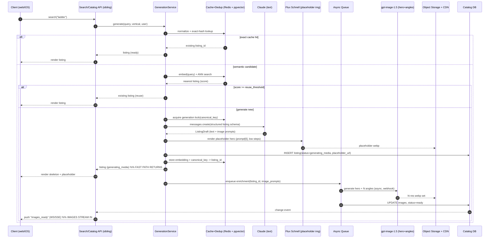
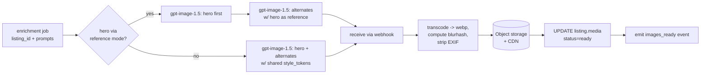
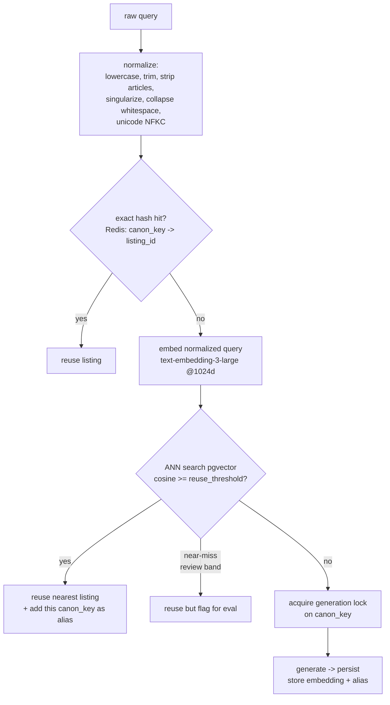
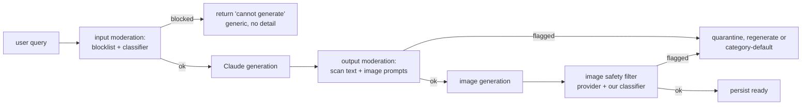
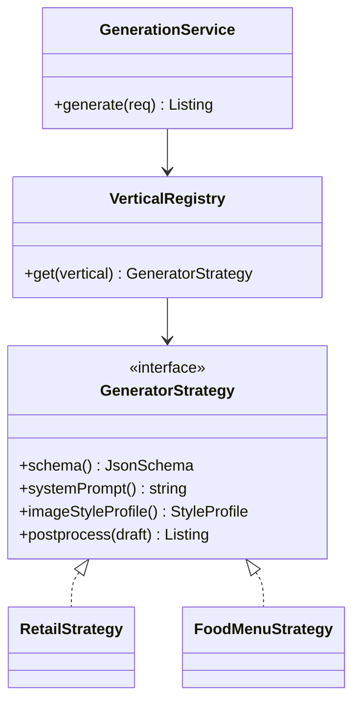

# 02 — AI Generation Pipeline (On-Demand Catalog Generation)

> **Owner:** Applied-AI / ML-Platform
> **Status:** Design proposal (greenfield)
> **Scope:** Everything inside the *generation subsystem*. The domain/API team owns the
> `search → miss → generate → persist` seam and the listing data model; we consume that seam
> and own how a listing is *produced*.
> **Date:** 2026-06-20

---

## 0. TL;DR — Opinionated recommendations

| Decision | Recommendation | Why |
|---|---|---|
| Listing-text model | **Claude Opus 4.8** (`claude-opus-4-8`) for quality; **Claude Haiku 4.5** (`claude-haiku-4-5`) as the fast-path / fallback tier | Opus 4.8 gives best instruction-following + structured output; Haiku is 5× cheaper and fast for high-volume / seeded content. Grounded in the `claude-api` skill model table. |
| Structured output | Claude **structured outputs** via `output_config.format` (`json_schema`, `strict`-equivalent) | One call returns a validated listing object incl. image-generation prompts. No prefill (rejected on 4.8). |
| Image model | **OpenAI `gpt-image-1.5`** as primary (multi-image consistency, webhooks); **Flux Schnell** (via fal/Replicate) for the *fast-path placeholder* | gpt-image-1.5 is purpose-built for product consistency; Flux Schnell renders ~1.2 s for an instant low-fi hero. |
| Image delivery | **Async** to object storage + CDN; signed URLs persisted on the listing; clients subscribe for the swap | Quality images take 5–130 s — never block the user. |
| Embeddings | **OpenAI `text-embedding-3-large`** (Matryoshka-truncated to 1024 dims) | Safe default, strong MTEB, dimension truncation cuts storage. Voyage 3.5 is the accuracy-per-dollar alternative. |
| Vector store | **pgvector (HNSW)** co-located with the primary catalog DB; revisit Qdrant past ~20–50M listings | Avoids a second datastore; transactional dedup; HNSW matches dedicated DBs at our scale. |
| Dedup / canonicalize | Normalize → exact-hash cache → semantic NN search (cosine ≥ threshold) → reuse-or-generate, behind a per-canonical **generation lock** | Stops "ladder" / "a ladder" / "ladders" from each minting a new listing. |
| Cost control | Prompt caching, Haiku fallback, batch seeding of popular categories, per-user + global budgets, generation locks | Generation is the expensive path; most traffic should hit cache or seed. |
| Vertical extensibility | **Generator-strategy-per-vertical**: a registry of `{schema variant, prompt template, image style profile}` keyed by vertical | Adding "food / menu item" is config, not a rewrite. |

Rough cost per *cold* generation (Opus text + 1 hero image + embedding): **≈ $0.05–0.09**. Cache/seed hits are **≈ $0.00** (CDN + DB read). See §5.

---

## 1. End-to-end generation flow

### 1.1 The seam we consume

The backend exposes a single logical entry point (designed by the domain agent):

```
search(query, vertical, user) ->
    if hit:    return listing
    else:      GenerationService.generate(GenerationRequest) -> persist -> return listing
```

We own `GenerationService`. It must (a) return *something renderable* fast, and (b) keep
improving the listing asynchronously. We split the work into a **synchronous fast path** and
**asynchronous enrichment**.

### 1.2 Two-phase model

| Phase | Latency target | Produces | Model(s) |
|---|---|---|---|
| **Fast path (sync)** | p50 < 2.5 s, p95 < 4 s | Full listing *text* (title, description, specs, price, category, attributes) + a low-fi placeholder hero image | Claude (text) + Flux Schnell (placeholder) |
| **Async enrichment** | best-effort, 5–90 s | High-quality hero + alternate-angle images, style-consistent | gpt-image-1.5 |

The fast path persists a listing record immediately with `status = "generating_media"` and a
**placeholder image**. Async enrichment swaps in real images and flips `status = "ready"`.

### 1.3 Sequence diagram



### 1.4 Placeholder / streaming UX contract (for the client team)

This is the load-bearing contract. The listing object always carries a `media` block with an
explicit state so the client never has to guess.

```jsonc
// listing.media — present on every listing the client receives
{
  "status": "generating_media",        // "generating_media" | "ready" | "degraded"
  "hero": {
    "url": "https://cdn/.../placeholder.webp",
    "kind": "placeholder",             // "placeholder" | "final"
    "blurhash": "LKO2:N%2Tw=w]~RBVZRi", // for instant blurred render before bytes load
    "aspect_ratio": "1:1"
  },
  "alternates": [],                    // populated on enrichment
  "expected_ready_ms": 30000,          // hint for progress UI; not a guarantee
  "generation_id": "gen_01H..."        // for client-side correlation of the swap event
}
```

**Client rules:**

1. **Render text immediately.** Title/description/specs/price are final on the fast path —
   show them with no skeleton.
2. **Hero image:** render `blurhash` instantly, then load `hero.url`. If `kind == "placeholder"`,
   overlay a subtle "Enhancing photos…" shimmer.
3. **Swap, don't reload.** When the `images_ready` event arrives (WS/SSE channel keyed on
   `generation_id`), cross-fade the placeholder → final hero and reveal `alternates`. Never
   re-fetch the whole listing or re-mount the screen.
4. **Degraded path:** if enrichment fails after retries, `status = "degraded"` and the hero
   stays the placeholder (or a category-default image). The listing is still fully usable —
   never show an error or block ordering.
5. **No spinner on the order button.** A `generating_media` listing is orderable; media state
   is cosmetic.

> **Alignment needed (real-time team):** the `images_ready` push uses the same WS/SSE fan-out the
> order-tracking feature uses. Payload is thin (`{generation_id, listing_id, media}`) — client
> re-reads `media` and swaps. See §8 for the event contract.

---

## 2. Structured generation with Claude

> Grounded in the `claude-api` skill: model IDs, pricing, structured outputs via
> `output_config.format`, prompt caching, and adaptive thinking are taken from that reference,
> not from memory. Notably: **no assistant prefill** (rejected with 400 on Opus 4.8), and
> `output_config.format` is the canonical structured-output parameter (the old `output_format`
> is deprecated).

### 2.1 Model choice

| Tier | Model ID | Input / Output ($/MTok) | Use |
|---|---|---|---|
| Quality (default) | `claude-opus-4-8` | $5 / $25 | First-class listings users searched for. Best instruction-following + JSON-schema adherence. |
| Fast / bulk | `claude-haiku-4-5` | $1 / $5 | Category seeding, low-value verticals, fallback under budget pressure or 429s. |

**Recommendation: default to `claude-opus-4-8`.** A listing is a *user-visible artifact* that we
persist forever and that drives the "magical" feeling — quality matters more than the marginal
cost, and prompt caching (§5) makes the system prompt nearly free across requests. Use
`claude-haiku-4-5` only for (a) precomputed seeding where volume dominates, and (b) a fallback
tier when Opus is rate-limited or a per-window budget is exhausted.

**Thinking/effort:** the listing task is bounded and schema-constrained. Use
`output_config: {effort: "low"}` with adaptive thinking left at default — we want speed on the
fast path, and the structure does the heavy lifting. Do **not** raise effort here; it only adds
latency to a well-specified extraction-style task.

**Streaming:** `max_tokens` is small (a listing is ~600–1200 output tokens), so a non-streaming
call is fine and simpler. Keep `max_tokens ≈ 2000`.

### 2.2 Listing schema (retail default variant)

Passed as `output_config.format = {type: "json_schema", schema: <below>}`. `additionalProperties:
false` and `required` on every object (structured-output requirement).

```json
{
  "type": "object",
  "additionalProperties": false,
  "required": ["title", "description", "category", "bullet_specs",
               "attributes", "price", "image_prompts"],
  "properties": {
    "title":       { "type": "string", "description": "Concise retail product title, <= 80 chars" },
    "description": { "type": "string", "description": "2-4 sentence marketing description" },
    "category":    { "type": "string", "description": "Single canonical category, e.g. 'Tools > Ladders'" },
    "bullet_specs": {
      "type": "array",
      "description": "3-6 short spec bullets",
      "items": { "type": "string" }
    },
    "attributes": {
      "type": "array",
      "description": "Structured key/value facets for filtering",
      "items": {
        "type": "object",
        "additionalProperties": false,
        "required": ["key", "value"],
        "properties": {
          "key":   { "type": "string" },
          "value": { "type": "string" }
        }
      }
    },
    "price": {
      "type": "object",
      "additionalProperties": false,
      "required": ["currency", "amount_min", "amount_max"],
      "properties": {
        "currency":   { "type": "string", "enum": ["USD"] },
        "amount_min": { "type": "number" },
        "amount_max": { "type": "number" }
      }
    },
    "image_prompts": {
      "type": "object",
      "additionalProperties": false,
      "required": ["hero", "alternates"],
      "properties": {
        "hero":       { "type": "string", "description": "Detailed text-to-image prompt for the primary hero shot" },
        "alternates": {
          "type": "array",
          "description": "1-3 alternate-angle / detail prompts that share product identity with the hero",
          "items": { "type": "string" }
        },
        "style_tokens": {
          "type": "array",
          "description": "Shared style descriptors injected into every image prompt for consistency",
          "items": { "type": "string" }
        }
      }
    }
  }
}
```

> **Key design point:** Claude *authors the image prompts*. It generates text but cannot generate
> images, so it acts as the **prompt orchestrator** for the image model — emitting a hero prompt,
> alternate-angle prompts, and a set of shared `style_tokens` that we concatenate into every image
> request to keep the product visually identical across shots (§3).

### 2.3 Prompt strategy

Render order (for prompt caching) is `system → messages`. Keep everything stable in `system`,
put only the volatile query at the end.

- **System prompt (cached, `cache_control: ephemeral`):** role ("You generate realistic but
  entirely fictional product listings for a shopping simulator"), the vertical's style/voice
  rules, pricing realism guidance, the "everything is fake" framing, and explicit instructions
  for writing image prompts (photographic, neutral background, product centered, include
  `style_tokens` for cross-shot consistency). This block is identical across millions of requests
  → cache it. Verify with `usage.cache_read_input_tokens`.
- **User message (volatile):** the normalized query + minimal context (`vertical`, optional
  locale). Nothing dynamic (timestamps/UUIDs) in `system` — that would silently break the cache.
- **Determinism-ish consistency:** sampling params (`temperature`, etc.) are removed on Opus 4.8,
  so we steer via prompt. For seeded categories where we want repeatability we instead pin the
  *output* by caching the generated listing keyed on the canonical query (§4), not by trying to
  make the model deterministic.

Illustrative call (Python, per the `claude-api` skill — `output_config.format`, no prefill):

```python
resp = client.messages.create(
    model="claude-opus-4-8",
    max_tokens=2000,
    output_config={"effort": "low", "format": {"type": "json_schema", "schema": LISTING_SCHEMA}},
    system=[{"type": "text", "text": SYSTEM_PROMPT, "cache_control": {"type": "ephemeral"}}],
    messages=[{"role": "user", "content": f"vertical=retail\nquery={normalized_query}"}],
)
listing = json.loads(next(b.text for b in resp.content if b.type == "text"))
```

---

## 3. Image generation

### 3.1 Provider recommendation

| Need | Pick | Rationale |
|---|---|---|
| **Final hero + alternates** (quality, multi-image product consistency) | **OpenAI `gpt-image-1.5`** | Trained to reduce visual inconsistency across multiple images of the *same* product — exactly our multi-angle need — and ships async **webhooks** for backend integration. Latency 5–130 s, so async only. |
| **Instant placeholder** (fast path) | **Flux Schnell** (via fal.ai or Replicate) | ~1.2 s render, cheap, "good enough" to fill the hero slot during the skeleton phase. |
| Cost-optimized bulk seeding | `gpt-image-1.5` *low quality* (~$0.009/img) or Imagen 4 Fast (~$0.02/img) | For precomputed popular categories where we batch overnight. |

Trade-offs: gpt-image-1.5 wins on product consistency and webhook ergonomics but is the slow,
premium path; Flux Schnell wins on latency/cost but not identity-consistency across a multi-shot
set — which is why it's only the throwaway placeholder. Imagen 4 Fast / Grok Imagine
(~$0.02/img) are viable swaps for the placeholder tier if Flux availability is a concern.

The provider is abstracted behind an `ImageProvider` interface (`generate(prompt, opts) -> job`)
so we can A/B or swap without touching the pipeline.

### 3.2 How Claude's prompts drive the image model

Claude emits `image_prompts.hero`, `image_prompts.alternates[]`, and `image_prompts.style_tokens[]`.
The image pipeline composes each request as:

```
final_image_prompt = <angle prompt> + ", " + join(style_tokens) + ", " + GLOBAL_STYLE_SUFFIX
```

Where `GLOBAL_STYLE_SUFFIX` is a per-vertical fixed string ("studio product photography, soft
diffused lighting, seamless neutral background, centered, e-commerce catalog style, no text,
no watermark"). The `style_tokens` are what bind the alternates to the hero (same material,
colorway, finish) so the four shots read as one product.

For **strongest** identity consistency on alternates, prefer the image model's *edit/reference*
mode where supported: generate the hero first, then pass the hero as a reference image when
generating alternate angles. gpt-image-1.5's multi-image consistency makes this the recommended
path; the prompt-token approach is the fallback when reference mode isn't available.

### 3.3 Multi-image, aspect ratios, consistency

- **Hero:** `1:1` (1024×1024) — the catalog grid + product page primary.
- **Alternates:** `1:1` for grid consistency; optionally one `4:3` detail/lifestyle shot.
- **Count:** hero + up to 3 alternates (config per vertical; retail default = hero + 2).
- **Consistency levers (in priority order):** (1) reference-image mode off the hero, (2) shared
  `style_tokens`, (3) fixed `GLOBAL_STYLE_SUFFIX`, (4) same model + size across the set.

### 3.4 Latency & async delivery



- **Worker queue:** enrichment runs on a dedicated async worker pool (e.g. SQS/Cloud Tasks +
  workers). Use the image provider's **webhook** callback so a worker isn't blocked for 130 s.
- **Storage/CDN:** write webp to object storage (S3/GCS) under a content-addressed key, front
  with a CDN; persist the CDN URL + blurhash on `listing.media`. Strip EXIF; cap dimensions.
- **Timeouts/retries:** per-image timeout 150 s; 2 retries with backoff; on final failure mark
  `status = "degraded"` and keep the placeholder (or category-default image). Never fail the
  listing.
- **Idempotency:** enrichment is keyed on `generation_id`; a duplicate webhook or re-enqueue is a
  no-op if `status == ready`.

---

## 4. Caching, dedup & canonicalization

The core problem: `ladder`, `a ladder`, `Ladders`, `step ladder` must not each mint a fresh
listing. Three layers, cheapest first.

### 4.1 Pipeline



### 4.2 Normalization

Deterministic, language-aware: lowercase, NFKC unicode normalize, trim, collapse whitespace,
strip leading articles (`a/an/the`), light singularization (`ladders → ladder`), and a small
synonym/stopword map per vertical. Output = `canon_key`. This alone collapses the obvious
variants and is free.

### 4.3 Exact cache (Redis)

`canon_key → listing_id`. O(1), sub-millisecond. Every successful generation writes its
`canon_key` *and* any alias keys that resolved to it. This is the hot path for popular queries.

### 4.4 Semantic dedup (embeddings + vector store)

For queries that normalize differently but mean the same thing (`step ladder` vs `folding
ladder` vs `extension ladder` — judgment call) we embed and ANN-search existing listings.

- **Embedding model:** **`text-embedding-3-large`**, truncated via Matryoshka to **1024 dims**
  (storage/latency win, negligible quality loss). It's the safe high-MTEB default. **Voyage 3.5**
  is the accuracy-per-dollar alternative and **Cohere embed-v4** if we later want hybrid
  dense+sparse in one call. Keep the model behind an `Embedder` interface — embeddings are
  model-specific, so a swap means a re-index.
- **Vector store:** **pgvector with an HNSW index**, co-located in the primary Postgres catalog
  DB. Rationale: no second datastore to operate, dedup can be transactional with the listing
  insert, and HNSW matches/beats dedicated DBs up to ~1M and is fine to tens of millions on a
  well-provisioned instance. **Revisit Qdrant** (best filtered-search + ops simplicity on a
  budget) or Pinecone (managed, enterprise) past ~20–50M listings or if filtered ANN latency
  becomes the bottleneck.
- **Thresholds:** two cosine bands — `reuse_threshold` (e.g. ≥ 0.92, reuse outright) and a
  `review_band` (e.g. 0.86–0.92, reuse but log for offline eval to tune the line). Below the
  band → generate. Thresholds are config and must be tuned against the eval set (§6), not
  guessed.

### 4.5 Generation lock (thundering-herd / race control)

Two users searching `ladder` within the same second must not trigger two generations. Acquire a
short-TTL distributed lock on `canon_key` (Redis `SET NX PX`). The loser **waits** on the
listing record (or a pub/sub completion signal) and returns the same listing. This makes
dedup correct under concurrency and is essential for cost control.

### 4.6 Cache layers summary

| Layer | Store | Key | Latency | Purpose |
|---|---|---|---|---|
| L0 CDN | CDN | image URL | ~ms | Image bytes |
| L1 Exact | Redis | `canon_key` | <1 ms | Variant collapse, hot queries |
| L2 Semantic | pgvector (HNSW) | query embedding | ~5–30 ms | Meaning-level dedup |
| L3 Listing | Postgres | `listing_id` | ~ms | Source of truth |
| Prompt cache | Anthropic | system-prompt prefix | n/a | Cuts text-gen input cost ~90% |

---

## 5. Cost & abuse controls

### 5.1 Rough per-generation cost (current pricing from the `claude-api` skill + image search)

| Component | Assumption | Cost |
|---|---|---|
| Claude Opus 4.8 text | ~1.5K input (mostly cache-read) + ~1K output | input cache-read ~$0.0008 + output ~$0.025 ≈ **$0.026** |
| Placeholder image (Flux Schnell) | 1 img | ~**$0.003** |
| Hero + 2 alternates (gpt-image-1.5, standard) | 3 imgs @ ~$0.02 | ~**$0.06** |
| Embedding (text-embedding-3-large) | 1 short query | ~**$0.00001** |
| **Cold total** | | **≈ $0.05–0.09** |
| **Cache/seed hit** | CDN + DB read only | **≈ $0.00** |

Using **Haiku 4.5** for the text drops the text component to ~$0.005; using gpt-image-1.5 *low*
quality drops images to ~$0.027 for three. The dominant cost is images — so the levers below
mostly fight *new image generation*.

### 5.2 Controls

1. **Dedup is the #1 cost control.** Every cache/seed hit is a near-zero-cost generation. The
   whole §4 pipeline pays for itself in image spend avoided.
2. **Precompute / seed popular categories** — overnight **batch** generation of the top-N
   expected queries per vertical (using Claude's **Message Batches API**, 50% cheaper, + Haiku +
   batched image jobs). Seeds the L1/L2/L3 caches before launch so the common case is always a hit.
3. **Prompt caching** — the large stable system prompt is cached (`cache_control: ephemeral`);
   verify `cache_read_input_tokens > 0` to confirm.
4. **Cheaper-model fallback** — under budget pressure or Claude 429s, the text tier degrades
   Opus → Haiku automatically; image tier can degrade to *low* quality or placeholder-only.
5. **Rate limits & budgets:**
   - **Per-user:** token-bucket on *cold generations* (e.g. N new listings / hour). Cache/seed
     hits don't count against it — only genuinely new work does.
   - **Global:** a daily generation-spend budget; when 80% consumed, switch the text tier to
     Haiku and the image tier to placeholder-only (still fully usable listings), and alert.
   - **Generation lock** (§4.5) prevents duplicate concurrent spend on the same query.
6. **Batching** image jobs where the provider supports it; batch overnight seeding.

### 5.3 Budget enforcement points

```
search miss
  -> per-user rate check (cold gens only)
  -> global budget check -> may downgrade tier
  -> generation lock
  -> generate (tier-aware)
```

---

## 6. Quality & safety

### 6.1 Moderation (two gates)



- **Input gate:** a blocklist of disallowed categories (weapons, regulated/illegal goods, CSAM,
  hateful/extremist merch, real-person likeness, etc.) plus a moderation classifier. Block *before*
  spending a generation. Return a generic refusal — don't reveal the rule.
- **Claude as a guardrail:** the system prompt explicitly forbids disallowed item types; Claude
  may return `stop_reason: "refusal"` — **check `stop_reason` before reading `content`** (per the
  `claude-api` skill) and treat a refusal as a hard block, not an error.
- **Output gate:** scan generated text *and* the image prompts (the image prompt is the real risk
  surface) before sending to the image model.
- **Image gate:** rely on the provider's built-in safety filter plus our own NSFW/brand classifier
  on the returned bytes; quarantine on flag.

### 6.2 Consistency ("deterministic-ish")

Sampling params are gone on Opus 4.8, so we don't pursue token-level determinism. Instead:
- **Cache the artifact**, not the randomness — the canonical-key cache means a given query maps to
  one stable listing forever (§4).
- **Style profiles** keep images visually coherent across a product's shots (§3.2).
- **Schema constraints** keep structure invariant.

### 6.3 Evaluation strategy ("how do we measure a good listing?")

- **Golden set:** a curated set of queries with human-rated reference listings per vertical.
- **LLM-as-judge:** a separate Claude call scoring each generated listing on a rubric
  (plausibility, spec coherence, price realism, description quality, category correctness,
  image-prompt quality) — gradeable criteria, not vibes. Run on a sampled % of production +
  the full golden set on every prompt/model change.
- **Dedup metrics:** precision/recall of the reuse decision against labeled query pairs; use
  the `review_band` logs to tune thresholds.
- **Image QA:** automated checks (single centered subject, neutral background, no text/watermark,
  aspect ratio) + periodic human spot-check.
- **Production signals:** swap-event latency, enrichment failure rate, `degraded` rate, regenerate
  rate, user dwell/order-through on generated vs seeded listings.

### 6.4 Human-in-the-loop / regeneration

- **Regenerate endpoint** (admin + optional user-facing "not quite right"): re-runs generation for
  a `listing_id`, optionally with a steering hint, versioning the old listing rather than deleting.
- **Quarantine queue** for moderation-flagged content → human review → approve/block/regenerate.
- **Eval-driven rollback:** prompt/model changes ship behind the eval gate; regressions roll back
  the prompt template version.

---

## 7. Extensibility — generator strategy per vertical

Generating a *retail product* vs a *restaurant/menu item* differs only in (a) the output schema,
(b) the prompt template, and (c) the image style. So we make those three things **configuration**,
behind a strategy registry.

### 7.1 Pattern



A `GeneratorStrategy` bundles:

| Element | Retail | Food / menu item |
|---|---|---|
| **Schema variant** | title, specs, attributes, price range, image_prompts | dish name, description, ingredients[], allergens[], dietary_tags[], price (single), plating image_prompts |
| **System prompt template** | "fictional product…" | "fictional menu item…", culinary voice, plating cues |
| **Image style profile** | studio product photography, neutral bg | overhead/45° food photography, plated, restaurant lighting |
| **Image config** | hero 1:1 + 2 alt | hero 4:3 (plate) + 1 detail |
| **Postprocess** | normalize attributes | derive allergen flags, validate dietary tags |

The core pipeline (normalize → dedup → generate → enrich → persist) is **vertical-agnostic**; only
the strategy plugs in the differences. Adding "food" = register a `FoodMenuStrategy` with its
schema/prompt/style — **no pipeline rewrite, no new code paths.** The vector store and dedup
namespace are partitioned by vertical so a "ladder" never dedups against a dish.

### 7.2 Config-as-data option

Strategies can be expressed as data (`vertical.yaml`: schema ref, prompt template, style profile,
image config, thresholds) loaded at startup, so new verticals or prompt tweaks ship without a
deploy where policy allows.

---

## 8. Interface contract (generation service ↔ rest of backend)

### 8.1 Synchronous: `generate`

**Request**

```jsonc
{
  "query": "ladder",
  "vertical": "retail",
  "user_id": "usr_01H...",
  "locale": "en-US",            // optional
  "request_id": "req_01H..."    // idempotency / tracing
}
```

**Response (fast path)**

```jsonc
{
  "listing_id": "lst_01H...",
  "generation_id": "gen_01H...",
  "origin": "generated",        // "exact_cache" | "semantic_reuse" | "seed" | "generated"
  "status": "generating_media", // "ready" | "generating_media" | "degraded"
  "listing": {
    "title": "16 ft Aluminum Extension Ladder",
    "description": "...",
    "category": "Tools > Ladders",
    "bullet_specs": ["..."],
    "attributes": [{"key": "Material", "value": "Aluminum"}],
    "price": {"currency": "USD", "amount_min": 119, "amount_max": 149},
    "media": {
      "status": "generating_media",
      "hero": {"url": "https://cdn/.../placeholder.webp", "kind": "placeholder",
               "blurhash": "LKO2...", "aspect_ratio": "1:1"},
      "alternates": [],
      "expected_ready_ms": 30000,
      "generation_id": "gen_01H..."
    }
  }
}
```

**Errors**

```jsonc
{ "error": { "type": "moderation_blocked" | "rate_limited" | "budget_exhausted"
                     | "generation_failed",
             "message": "...", "retryable": false } }
```

`moderation_blocked` → generic, non-revealing. `rate_limited` → carries `retry_after_s`.

### 8.2 Asynchronous events (published to the backend's event bus / WS-SSE fan-out)

```jsonc
// images.ready
{ "type": "images.ready",
  "generation_id": "gen_01H...", "listing_id": "lst_01H...",
  "media": { "status": "ready",
             "hero": {"url": "https://cdn/.../hero.webp", "kind": "final",
                      "blurhash": "...", "aspect_ratio": "1:1"},
             "alternates": [{"url": "...", "blurhash": "...", "aspect_ratio": "1:1"}] } }

// images.degraded
{ "type": "images.degraded",
  "generation_id": "gen_01H...", "listing_id": "lst_01H...",
  "media": { "status": "degraded",
             "hero": {"url": "https://cdn/.../placeholder.webp", "kind": "placeholder", "...": "..."} } }
```

The client subscribes on `generation_id` (returned in the sync response) and applies the `media`
block via cross-fade swap (§1.4). The thin payload means the client never re-fetches the listing.

### 8.3 Admin / lifecycle (internal)

| Endpoint | Purpose |
|---|---|
| `POST /internal/regenerate {listing_id, hint?}` | Re-run generation; versions the listing |
| `POST /internal/seed {vertical, queries[]}` | Batch-seed popular queries (uses Batches API) |
| `GET /internal/generation/{generation_id}` | Status/trace for a generation |
| `POST /internal/quarantine/{listing_id}/resolve` | Human-review decision |

---

## 9. Cross-team alignment checklist

| Team | What they must align on |
|---|---|
| **Backend / domain** | The `generate` request/response shape (§8.1); persistence seam writes a listing in `generating_media` on the fast path and updates `media` + `status` on enrichment; idempotency on `request_id`/`generation_id`. |
| **Client (web/iOS)** | The **placeholder/streaming media contract** (§1.4): render text immediately, blurhash → placeholder → final cross-fade, subscribe on `generation_id`, listing is orderable while `generating_media`, `degraded` is not an error. |
| **Real-time team** | `images.ready` / `images.degraded` ride the same WS/SSE channel as order tracking; thin payload keyed on `generation_id`; client re-reads `media` and swaps. |
| **Platform / infra** | pgvector (HNSW) on the primary Postgres; Redis for exact cache + generation locks; async worker pool + image-provider webhooks; object storage + CDN; secrets for Anthropic + image provider. |
| **Trust & safety** | Disallowed-category blocklist + classifier thresholds; quarantine review workflow; refusal handling. |
| **Finance/ops** | Per-user + global generation budgets and the Opus→Haiku / final→placeholder degrade thresholds. |

---

## 10. Open questions / follow-ups

- Tune `reuse_threshold` / `review_band` against a labeled dedup eval set before launch.
- Confirm gpt-image-1.5 reference-mode availability for alternate-angle consistency; else fall
  back to shared `style_tokens` only.
- Decide seeding breadth (top-N per vertical) vs. cold-start tolerance.
- Embedding model lock-in: a future swap requires a full re-index — pick once, deliberately.

---

### Sources (2026 research)

- [Text-to-image API pricing comparison 2026 — Digital Applied](https://www.digitalapplied.com/blog/ai-image-generation-api-pricing-comparison-2026)
- [Cheapest image-gen models 2026 — SiliconFlow](https://www.siliconflow.com/articles/en/the-cheapest-image-gen-models)
- [OpenAI gpt-image-1.5 API guide — Atlas Cloud](https://www.atlascloud.ai/blog/guides/openai-gpt-image-1.5-api-guide-next-generation-ai-image-generation)
- [OpenAI image generation guide](https://developers.openai.com/api/docs/guides/image-generation)
- [Embedding models comparison 2026 — Reintech](https://reintech.io/blog/embedding-models-comparison-2026-openai-cohere-voyage-bge)
- [Best embedding models 2026 — Openxcell](https://www.openxcell.com/blog/best-embedding-models/)
- [pgvector vs Pinecone vs Qdrant 2026 — KnowSync](https://www.knowsync.ai/blog/choosing-vector-database-qdrant-pinecone-pgvector-2026)
- [Vector DB benchmark 2026 — Medium / Imran Zaman](https://imranzaman-5202.medium.com/pgvector-vs-elasticsearch-vs-qdrant-vs-pinecone-vs-weaviate-a-14-case-benchmark-59add8eb9134)
- Claude model IDs, pricing, structured outputs, prompt caching, refusal handling: local `claude-api` skill reference.
